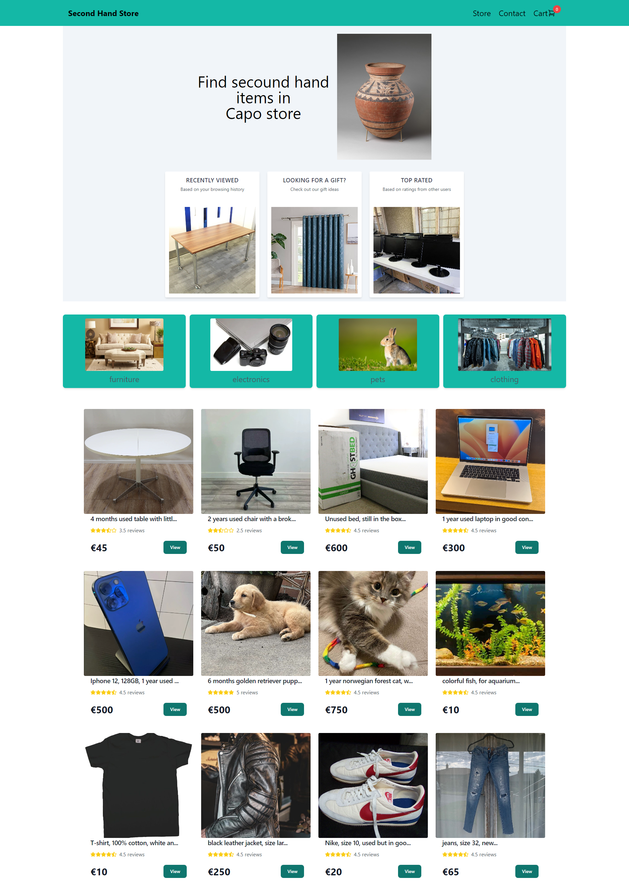
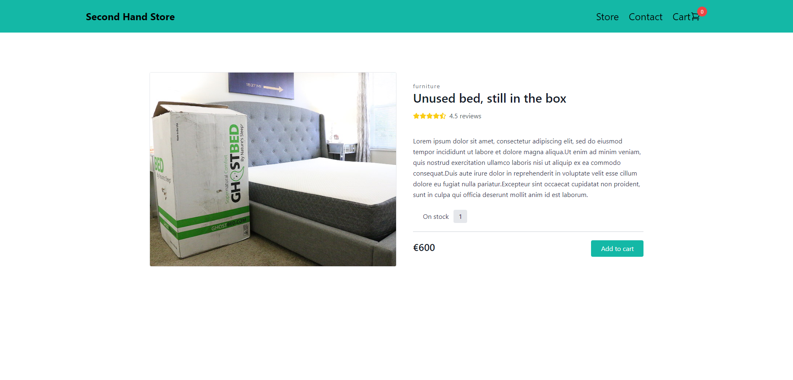
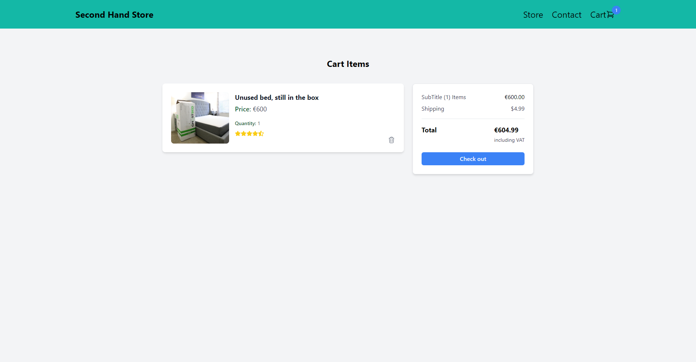

# Second Hand Shop eCommerce GraphQL Platform

> eCommerce platform built with the GraphQl and Node in the backend & rGraphQl and React in the frontend.






## Usage

### Install Dependencies (frontend)

```
cd root directory
yarn
```

### Run

```

# Run frontend (:3000)
yarn start
```

## Tech

Frontend

- [React]
- [ApolloClient]


[React]: https://react.dev/
[ApolloClient]: https://www.apollographql.com/docs/react
 